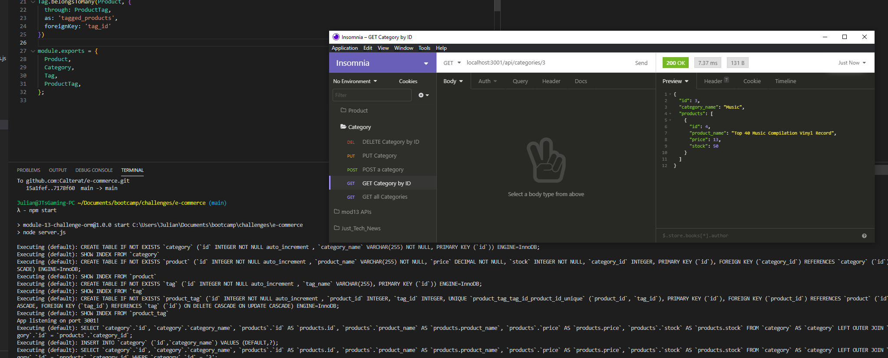

# E-Commerce Back End

My name is Julian. Welcome to my E-Commerce Back End node app.

## Description

This is the back-end portion of an e-commerce page that pulls data from a MySQL server using Sequelize.

## Table of Contents

- [E-Commerce Back End](#e-commerce-back-end)
  - [Description](#description)
  - [Table of Contents](#table-of-contents)
  - [Language(s)](#languages)
  - [Installation](#installation)
  - [Usage](#usage)
  - [Contributing](#contributing)
  - [Tests](#tests)
  - [License](#license)
  - [Questions](#questions)
  - [Comments](#comments)

## Language(s)

Language(s) used in this project:
JavaScript

## Installation

> Clone the repo with `git clone git@github.com:Calterat/e-commerce`, then navigate into the directory. create a .env file with DB_NAME='ecommerce_db', DB_USER='yourMySQLusername`, DB_PW=`yourMySQLpassword`. You'll need these for the app and to seed. Next, log into the MySQL shell and then `source db/schema.sql`. This creates your database. Quit MySQL. Seed the database by typing `npm run seed`. Next start the app with `npm start`. Use Insomnia Core to test all the endpoints in the app.

## Usage

>This is the start of back-end software for e-commerce. Build from here and grow!

[Here is a HowTo Video Link!](https://drive.google.com/file/d/1B6b0AaeoRkBymT0X3ZO3TA_IWKOn4M79/view)
        

## Contributing

> Help yourself to cloning, branching, and requesting pulls. I welcome any ideas!
 

## Tests

> N/A

## License

This project is covered under the license of [MIT License](https://GitHub.com/Calterat/e-commerce/main/LICENSE)

## Questions

You can find my repository URL [Here](https://GitHub.com/Calterat)

If you have additional questions, you may reach me at my E-mail Address: Calterat@gmail.com

## Comments

> This README is created from another one of my apps! Check it out [here](https://github.com/Calterat/readme-generator)

